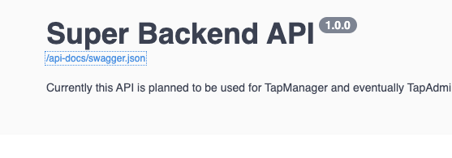
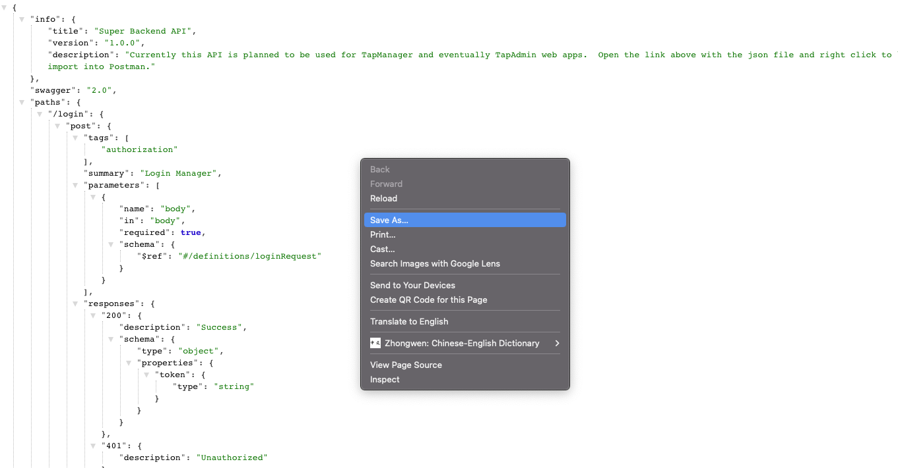
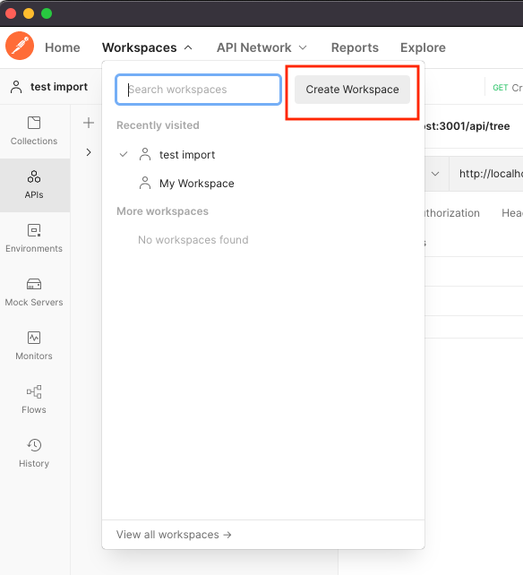
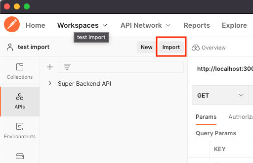

# Guide to view API documentation

The API documentation is generated and rendered by [Swagger](https://swagger.io/docs/).  Below are the instructions on how to view the documentation.

#### Instructions

1. Open terminal and navigate to the root directory of the super-backend repository.  Other options if you're using VSCode, then open through the menu options with `View > Terminal`.
2. Run the script `npm run dev`
3. Go to your browser and open the webpage `http://localhost:3000/api-docs/`

#### Import into Postman
To import the endpoints into Postman and use it to test the endpoints. You will need to do the following:

1. Click on the link to `/api-docs/swagger.json` on the top of the page of the Swagger docs. 
2. Right click and click `Save as...`

3. Open up Postman and create a new workspace.

4. Import the file you saved in step 2 by clicking on `Import`.  A window will pop up where you can drag the file you saved.

