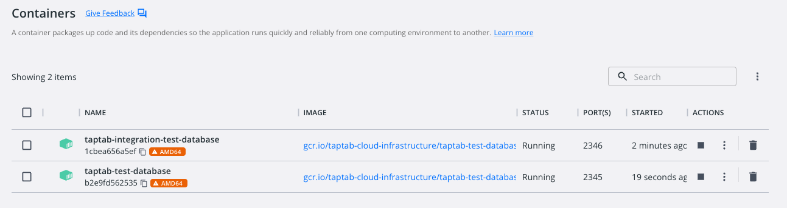

# super-backend

### based off this package [link](https://www.npmjs.com/package/typescript-express-starter)

# NODE VERSION

As of 2025, super backend is run on Node.js version 24.12.0 (LTS)
Make sure to have Node.js version 24.12.0 when using super backend and installing package lock

# Set up to run locally

1. Create a Postgres local database by going to the [Database repository](https://github.com/taptabapp/Database) and following [these instructions](https://github.com/taptabapp/Database?tab=readme-ov-file#scripts-and-tools) running `make` commands.

2. Make sure you have a `.env` file in the root directory of the project with `API_PORT = 3000` or whichever port you want to set it to.  3000 is commonly used for local environment.  Be sure to ask the backend lead for the most up to date `.env` file.

For the following steps you may either use Docker or npm scripts.

#### Using Docker
3. Run `ENV=dev make build-local` in the terminal to containerize the app with the latest code.
4. Run `ENV=dev make run` in the terminal to run the image you built in the previous step.
5. Make a request to `http://localhost:3100/<endpoint_path>`.  Port 3100 is set in the Make file to connect from the host when executing the `run` command and maps to port 3000 in the container set in step 2.

#### Using npm scripts

3. Run `npm install` in the command line at the root of the directory.
4. Finally run the development environment locally you can run `npm run dev`.  You can now make requests via Postman to the app locally with queries being made to the containerized database in step 2.

# Run the testing suites

For mac, install jest-cli globally on your system if you don't have it already: `npm i -g jest-cli`

## Unit tests
Run the command `npm run test`

## Integration tests
By default Jest sets `NODE_ENV` environment variable to `test`, more information [here](https://jestjs.io/docs/environment-variables)

There are two options to use the test database to run the integration tests:
1. Use the test database stored in a docker image in the GCP Artifact Registry. To use this image, just run `npm run test:integration` and the script will load this database. Make sure you have the proper credentials in the gcloud CLI. First time you download a new image version it could take a while, since the database image is 150MB+.
2. If you have a copy of the Database repo with patches not merged in yet (so they're not in the registry image), you can spin up this database first by using `make build` and `DB_PORT=2346 make run` on the Database repo and it will build a new docker with your local patches so you can test against it. After the database is up and running on docker with port 2346, run the `npm run test:integration-local` command.

A separate container with a test database just for integration tests will be spun up. Make sure port 2346 is free and run the ordered integration test script from the root directory with `npm run test:integration`.

### Testing Stripe Webhook Events Locally
https://stripe.com/docs/payments/checkout/fulfill-orders
1. Run backend normally on your local.
2. Run stripe event listener locally in different terminal window: `stripe listen --forward-to localhost:3000/stripe/webhook`
3. Trigger Stripe Events from Stripe Checkout or Stripe Dashboard
4. Can also trigger events from Stripe CLI: `stripe trigger customer.updated`

# Trouble shooting set up and installation

### if you run into " [nodemon] app crashed -  waiting for file changes"
#### try kill any running servers
- pkill -f node

# Additional Documentation
Guide on viewing the API documentation using Swagger [here](./Documentation/SWAGGER_DOCS.md).
Guide for Menu Sync Functionality [here](./Documentation/MENU_SYNC.md).
